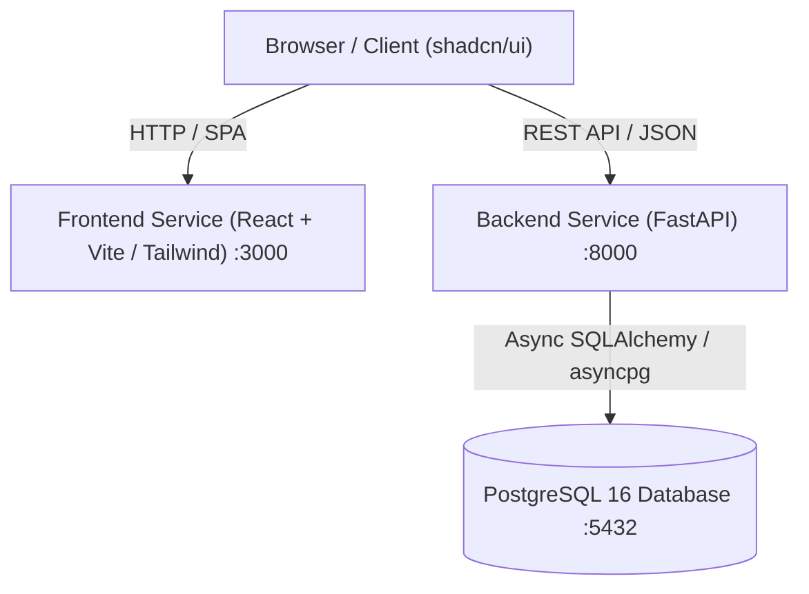
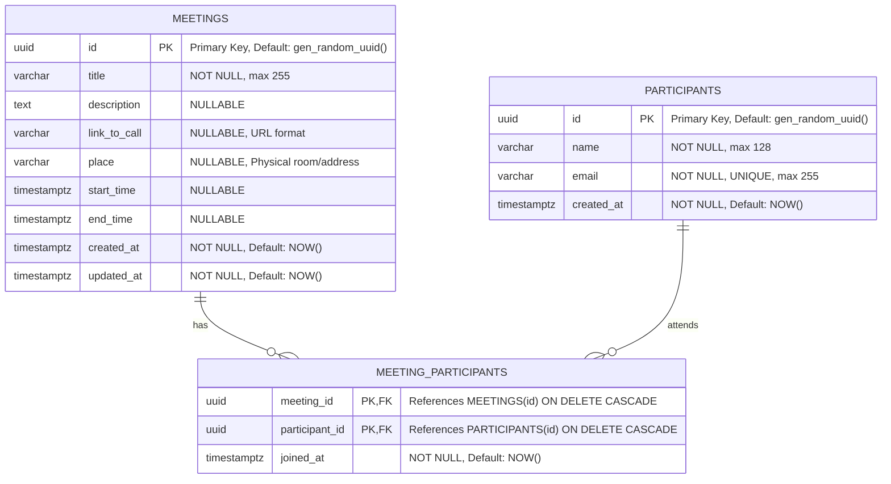

# Project Specification: Meeting Management Platform

## 1. Executive Summary

This document specifies the architecture, data models, API endpoints, frontend design, and containerization setup for a **Meeting Management Platform**. 
The application allows users to view a list of meetings, schedule new meetings with associated participants, and remove existing meetings.

---

## 2. Technical Stack & Architectural Overview

The project is structured as a **monorepo** containing separate directories for the frontend and backend services, orchestrated using **Docker Compose**.



### Core Technologies

| Layer | Technology | Key Libraries / Frameworks |
| :--- | :--- | :--- |
| **Backend** | Python 3.11+ / FastAPI | SQLAlchemy 2.0 (async), Alembic, Pydantic v2, Uvicorn, asyncpg |
| **Frontend** | TypeScript / React (Vite) | shadcn/ui, Tailwind CSS, TanStack Query, React Hook Form, Zod, Lucide Icons |
| **Database** | PostgreSQL 16 | Relational store with foreign keys, junction table, and indexes |
| **DevOps** | Docker & Docker Compose | Multi-stage Dockerfiles, health checks, environment configuration |

---

## 3. Monorepo Repository Structure

The project adopts a clean, split monorepo architecture:

```text
OOAD/
├── docker-compose.yml             # Orchestration for frontend, backend, and postgres
├── .env.example                   # Shared / sample environment configuration
├── .gitignore
├── specifications.md              # Project technical specification
├── back/                          # Backend service
│   ├── Dockerfile
│   ├── requirements.txt           # Python dependencies
│   ├── alembic.ini                # Migration configuration
│   ├── alembic/                   # Database migrations
│   │   ├── env.py
│   │   └── versions/
│   └── app/
│       ├── __init__.py
│       ├── main.py                # FastAPI application entrypoint & CORS
│       ├── core/
│       │   ├── __init__.py
│       │   ├── config.py          # Settings and env variables (pydantic-settings)
│       │   └── database.py        # Async engine, sessionmaker, Base class
│       ├── models/
│       │   ├── __init__.py
│       │   ├── meeting.py         # Meeting & MeetingParticipant association
│       │   └── participant.py     # Participant model
│       ├── schemas/
│       │   ├── __init__.py
│       │   ├── meeting.py         # Meeting request/response schemas
│       │   └── participant.py     # Participant request/response schemas
│       ├── crud/
│       │   ├── __init__.py
│       │   ├── crud_meeting.py    # Database queries for meetings
│       │   └── crud_participant.py# Database queries for participants
│       └── api/
│           ├── __init__.py
│           ├── deps.py            # Async DB session dependency
│           └── v1/
│               ├── __init__.py
│               ├── router.py      # Main v1 API router aggregator
│               ├── endpoints/
│               │   ├── meetings.py
│               │   └── participants.py
└── front/                         # Frontend service
    ├── Dockerfile
    ├── nginx.conf                 # Production reverse proxy / static server
    ├── package.json
    ├── tsconfig.json
    ├── vite.config.ts
    ├── tailwind.config.js
    ├── components.json            # shadcn/ui configuration
    ├── public/
    └── src/
        ├── App.tsx                # Main dashboard view
        ├── main.tsx               # Application entrypoint
        ├── index.css              # Tailwind base + shadcn styles
        ├── components/
        │   ├── ui/                # Generated shadcn/ui components (button, dialog, etc.)
        │   ├── meetings/
        │   │   ├── MeetingList.tsx
        │   │   ├── MeetingCard.tsx
        │   │   ├── AddMeetingDialog.tsx
        │   │   ├── DeleteMeetingDialog.tsx
        │   │   └── ParticipantBadgeList.tsx
        │   └── common/
        │       ├── Header.tsx
        │       └── EmptyState.tsx
        ├── api/                   # API client functions (fetch/axios)
        │   ├── client.ts
        │   └── meetings.ts
        ├── types/                 # TypeScript interfaces
        │   └── meeting.ts
        └── lib/
            └── utils.ts           # shadcn cn() utility
```

---

## 4. Database Schema & Domain Model

### 4.1 Entity Relationship Diagram (ERD)

A meeting has a **Many-to-Many** relationship with participants through the junction table `meeting_participants`.



### 4.2 Field Specifications

#### `meetings` Table
- `id`: `UUID`, Primary Key, indexed.
- `title`: `VARCHAR(255)`, non-nullable. Brief subject of the meeting.
- `description`: `TEXT`, nullable. Detailed agenda or notes.
- `link_to_call`: `VARCHAR(2048)`, nullable. Virtual meeting link (e.g., Google Meet, Zoom, MS Teams).
- `place`: `VARCHAR(255)`, nullable. Physical location or office room (e.g., "Conference Room A", "Virtual").
- `start_time`: `TIMESTAMP WITH TIME ZONE`, optional/nullable.
- `end_time`: `TIMESTAMP WITH TIME ZONE`, optional/nullable.
- `created_at`: `TIMESTAMP WITH TIME ZONE`, auto-populated on insert.
- `updated_at`: `TIMESTAMP WITH TIME ZONE`, auto-populated on update.

#### `participants` Table
- `id`: `UUID`, Primary Key.
- `name`: `VARCHAR(128)`, non-nullable.
- `email`: `VARCHAR(255)`, non-nullable, unique index.
- `created_at`: `TIMESTAMP WITH TIME ZONE`, auto-populated.

#### `meeting_participants` Table
- `meeting_id`: `UUID`, Foreign Key referencing `meetings(id)` with `ON DELETE CASCADE`.
- `participant_id`: `UUID`, Foreign Key referencing `participants(id)` with `ON DELETE CASCADE`.
- Composite primary key on `(meeting_id, participant_id)`.

---

## 5. API Specification (FastAPI)

Base URL: `/api/v1`

### 5.1 Meeting Endpoints

#### 1. List Meetings
- **Method**: `GET /api/v1/meetings`
- **Description**: Returns all meetings with their list of participants. Supports optional pagination and search filters.
- **Query Parameters**:
  - `skip`: `int` (default: 0)
  - `limit`: `int` (default: 50)
  - `search`: `string` (optional, filters by title/place)
- **Response**: `200 OK`
```json
[
  {
    "id": "3fa85f64-5717-4562-b3fc-2c963f66afa6",
    "title": "Quarterly Planning",
    "description": "Discuss Q4 objectives, roadmap, and deliverables.",
    "link_to_call": "https://meet.google.com/xyz-abcd-efg",
    "place": "Conference Room 3B",
    "start_time": "2026-10-01T10:00:00Z",
    "end_time": "2026-10-01T11:00:00Z",
    "created_at": "2026-09-21T08:00:00Z",
    "participants": [
      {
        "id": "e8a9317b-2e9b-4ec6-ba10-388fef226d9c",
        "name": "Alice Smith",
        "email": "alice@example.com"
      },
      {
        "id": "7b8d4f09-eec8-45a7-9f79-6dc5942aa374",
        "name": "Bob Jones",
        "email": "bob@example.com"
      }
    ]
  }
]
```

#### 2. Create Meeting
- **Method**: `POST /api/v1/meetings`
- **Description**: Creates a new meeting and links participants (by IDs or creates new participants if not existing).
- **Request Body**:
```json
{
  "title": "Quarterly Planning",
  "description": "Discuss Q4 objectives, roadmap, and deliverables.",
  "link_to_call": "https://meet.google.com/xyz-abcd-efg",
  "place": "Conference Room 3B",
  "start_time": "2026-10-01T10:00:00Z",
  "end_time": "2026-10-01T11:00:00Z",
  "participant_ids": [
    "e8a9317b-2e9b-4ec6-ba10-388fef226d9c",
    "7b8d4f09-eec8-45a7-9f79-6dc5942aa374"
  ]
}
```
- **Response**: `201 Created` (returns the full created meeting object).

#### 3. Get Meeting by ID
- **Method**: `GET /api/v1/meetings/{id}`
- **Response**: `200 OK` or `404 Not Found`.

#### 4. Delete Meeting
- **Method**: `DELETE /api/v1/meetings/{id}`
- **Description**: Deletes the meeting and automatically cascades deletion of junction records in `meeting_participants`. The participant records themselves remain intact.
- **Response**: `204 No Content`

---

### 5.2 Participant Endpoints

#### 1. List Participants
- **Method**: `GET /api/v1/participants`
- **Description**: Returns all registered participants (used for selection when creating a meeting).
- **Response**: `200 OK`
```json
[
  {
    "id": "e8a9317b-2e9b-4ec6-ba10-388fef226d9c",
    "name": "Alice Smith",
    "email": "alice@example.com"
  }
]
```

#### 2. Create Participant
- **Method**: `POST /api/v1/participants`
- **Request Body**:
```json
{
  "name": "Charlie Brown",
  "email": "charlie@example.com"
}
```
- **Response**: `201 Created`

---

## 6. Frontend Specification (shadcn/ui & React)

### 6.1 UI Components & Layout

1. **Header Navigation**:
   - Application title ("Meeting Manager").
   - Action button: `+ New Meeting` (opens `AddMeetingDialog`).
   - Theme toggle (light/dark mode).

2. **Meetings View**:
   - Rendered using responsive grid of `Card` components or an interactive `Table`.
   - Each card displays:
     - **Title**: Large bold header.
     - **Place**: Displayed with location icon (`MapPin`).
     - **Call Link**: Clickable link or button opening external call link (`Video` icon).
     - **Description**: Truncated or expandable notes text.
     - **Participants**: Badges (`Badge` component) displaying participant names/emails.
     - **Delete Action**: Danger button/icon triggering `DeleteMeetingDialog`.

3. **Add Meeting Modal (`Dialog`)**:
   - Built using `react-hook-form` + `zod` validation.
   - Form inputs:
     - `Title` (`Input`): Required, 1–255 characters.
     - `Place` (`Input`): Optional physical location or room name.
     - `Call Link` (`Input`): Optional URL validation.
     - `Description` (`Textarea`): Optional meeting notes.
     - `Participants` (`MultiSelect` / `Combobox`): Multi-select dropdown to choose participants from the participant list, with the ability to dynamically add a new participant.
   - Action buttons: `Cancel` and `Create Meeting` (with loading spinner).

4. **Delete Confirmation (`AlertDialog`)**:
   - Confirms deletion: *"Are you sure you want to delete this meeting? This action cannot be undone."*
   - Actions: `Cancel` and `Delete` (destructive variant).

5. **Toast Notifications**:
   - `sonner` or shadcn `Toast` alerts for success and error feedback upon creating/deleting meetings.

---

## 7. Docker & Containerization Architecture

### 7.1 Multi-Service `docker-compose.yml`

```yaml
version: '3.8'

services:
  db:
    image: postgres:16-alpine
    container_name: meeting_db
    restart: always
    environment:
      POSTGRES_USER: ${POSTGRES_USER:-postgres}
      POSTGRES_PASSWORD: ${POSTGRES_PASSWORD:-postgres}
      POSTGRES_DB: ${POSTGRES_DB:-meetings_db}
    ports:
      - "5432:5432"
    volumes:
      - postgres_data:/var/lib/postgresql/data
    healthcheck:
      test: ["CMD-SHELL", "pg_isready -U ${POSTGRES_USER:-postgres} -d ${POSTGRES_DB:-meetings_db}"]
      interval: 5s
      timeout: 5s
      retries: 5

  backend:
    build:
      context: ./back
      dockerfile: Dockerfile
    container_name: meeting_backend
    restart: always
    depends_on:
      db:
        condition: service_healthy
    environment:
      - DATABASE_URL=postgresql+asyncpg://${POSTGRES_USER:-postgres}:${POSTGRES_PASSWORD:-postgres}@db:5432/${POSTGRES_DB:-meetings_db}
      - CORS_ORIGINS=http://localhost:3000,http://127.0.0.1:3000
    ports:
      - "8000:8000"

  frontend:
    build:
      context: ./front
      dockerfile: Dockerfile
    container_name: meeting_frontend
    restart: always
    depends_on:
      - backend
    environment:
      - VITE_API_BASE_URL=http://localhost:8000/api/v1
    ports:
      - "3000:80"

volumes:
  postgres_data:
```

### 7.2 Service Dockerfiles

- **`back/Dockerfile`**:
  - Base: `python:3.11-slim`
  - Workdir: `/app`
  - Installs requirements, runs Alembic migrations on startup script, and launches Uvicorn server (`uvicorn app.main:app --host 0.0.0.0 --port 8000`).
- **`front/Dockerfile`**:
  - Multi-stage build:
    1. **Build stage** (`node:20-alpine`): Installs npm packages and runs `npm run build`.
    2. **Production stage** (`nginx:alpine`): Copies build artifacts to `/usr/share/nginx/html` and uses custom `nginx.conf` supporting SPA client-side routing.

---

## 8. Non-Functional Requirements & Security

1. **Input Validation**: Strict schema enforcement using Pydantic on backend and Zod on frontend.
2. **CORS Configuration**: FastAPI configured with `CORSMiddleware` restricted to the frontend origin in production.
3. **Database Integrity**: Foreign key cascade rules prevent orphaned junction records in `meeting_participants`.
4. **Resilience**: PostgreSQL health check ensures backend waits for database readiness before executing migrations or queries.
5. **Observability**: FastAPI automatic interactive documentation available at `http://localhost:8000/docs` (Swagger UI) and `http://localhost:8000/redoc`.
